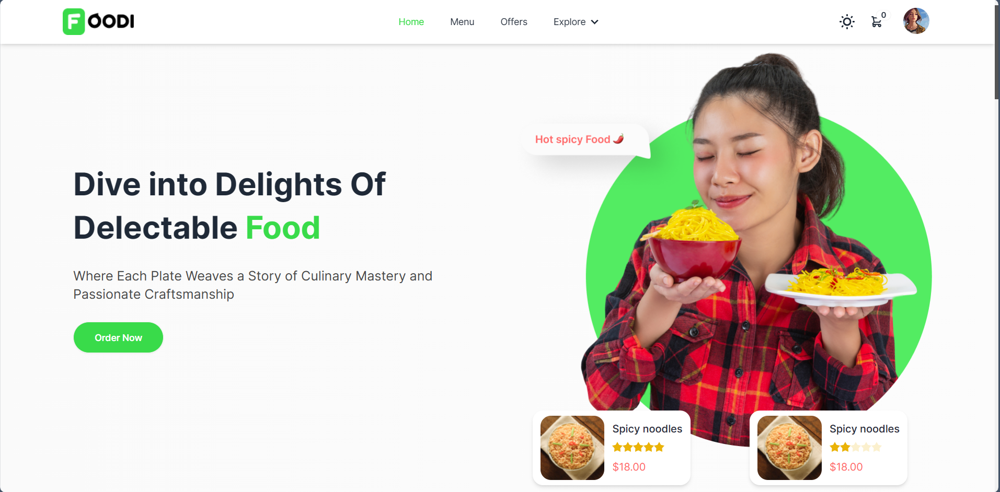

# Foodi eCommerce Website



Foodi is an eCommerce website where users can browse and order a variety of food items online. It provides a seamless shopping experience with features like user authentication, item cart management, order tracking, and an admin panel for managing products and transactions.

## Technologies Used

- MongoDB: Backend database for storing product and user information.
- Firebase: Authentication service for user signup and login.
- React: Frontend framework for building a responsive user interface.
- Express: Backend framework for handling server-side logic.
- Node.js: JavaScript runtime environment for running server-side code.
- Tailwind CSS: Utility-first CSS framework for styling.
- Stripe: Payment gateway integration for secure online transactions.

## Features

- User Authentication: Users can sign up and log in using email/password or Google authentication.
- Product Catalog: Browse through a wide range of food items available for purchase.
- Cart Management: Add/remove items to/from the cart and proceed to checkout for payment.
- Profile Customization: Users can update their name and profile image.
- Order Tracking: Track the status of orders placed.
- Admin Panel: Admins can add, update, or remove products, as well as view transaction history.

## Getting Started

1. Clone the repository:

```bash
git clone https://github.com/anshumansinha2001/Foodi-EcommerceWebsite.git
```

2. Install dependencies:

```bash
cd server
npm install
```

3. Set up environment variables:
   - Create a `.env` file in the root directory.
   - Add necessary environment variables like MongoDB URI, Firebase configuration, and Stripe API keys.

4. Start the development server:

```bash
npm start
```

5. Open your browser and navigate to `http://localhost:3000` to view the website.

## Contributing

Contributions are welcome! Feel free to open issues or pull requests for any improvements or bug fixes.

## License

This project is licensed under the [MIT License](LICENSE).

## Acknowledgments

- Thanks to [Stripe](https://stripe.com/) for providing a secure payment gateway.
- Special thanks to the open-source community for the amazing libraries and frameworks used in this project.

```
